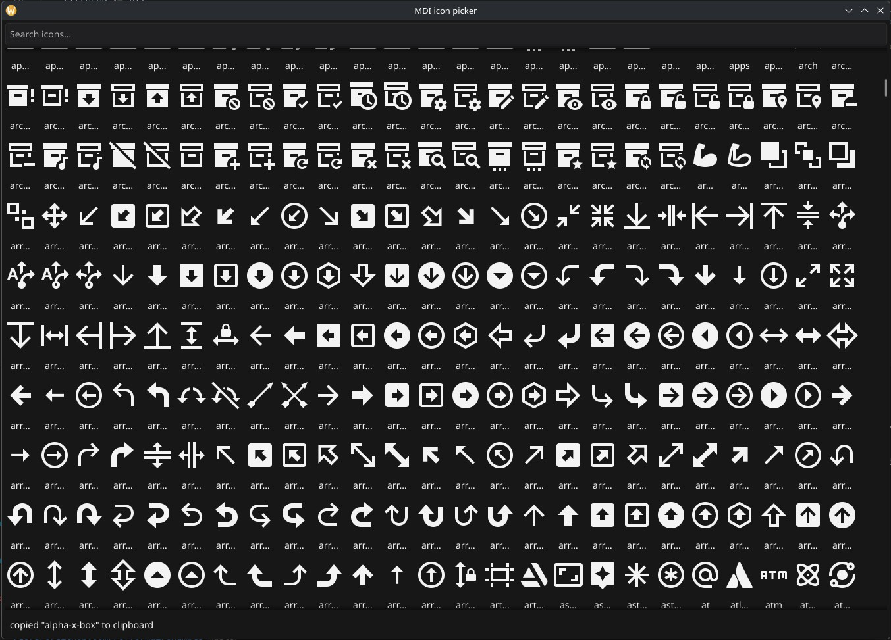

# mdi

[Material Design Icons](https://pictogrammers.com/library/mdi/) (7447 SVGs, v7.4.47) embedded as [Fyne](https://fyne.io) resources.

```sh
go get github.com/roffe/mdi
```

## Usage

```go
package main

import (
	"fyne.io/fyne/v2/app"
	"fyne.io/fyne/v2/widget"

	"github.com/roffe/mdi"
)

func main() {
	a := app.New()
	w := a.NewWindow("mdi demo")

	w.SetContent(widget.NewButtonWithIcon("Save", mdi.ThemedIcon(mdi.IconContentSave), func() {}))
	w.ShowAndRun()
}
```

### Typed constants

Every icon has a generated `IconName` constant in `names.go`:

```go
mdi.Icon(mdi.IconAccount)       // raw SVG resource (black fill)
mdi.ThemedIcon(mdi.IconAccount) // follows the theme's foreground color
```

Plain strings work too, since `IconName` is a string type:

```go
mdi.Icon("chevron-down")
```

Unknown names never return nil — both functions fall back to the
`border-none` placeholder icon.

### More examples

```go
// Toolbar
toolbar := widget.NewToolbar(
	widget.NewToolbarAction(mdi.ThemedIcon(mdi.IconPlus), addFunc),
	widget.NewToolbarAction(mdi.ThemedIcon(mdi.IconDelete), deleteFunc),
	widget.NewToolbarSeparator(),
	widget.NewToolbarAction(mdi.ThemedIcon(mdi.IconCog), settingsFunc),
)

// Plain icon widget
icon := widget.NewIcon(mdi.ThemedIcon(mdi.IconHome))

// List all icon names
for _, name := range mdi.Names() {
	fmt.Println(name)
}
```

## Icon picker

An icon browser lives in [example/](example/):

```sh
go run ./example
```



Type in the search box to filter all 7447 icons live; click an icon to copy
its name to the clipboard.

## Updating

```sh
./update.sh
```

Checks npm for a newer [`@mdi/svg`](https://www.npmjs.com/package/@mdi/svg), re-downloads the SVGs, regenerates `names.go`, and runs the tests. No-op if already up to date.

## License

Icons: [Pictogrammers Free License / Apache 2.0](LICENSE). Go code: same repo license.
